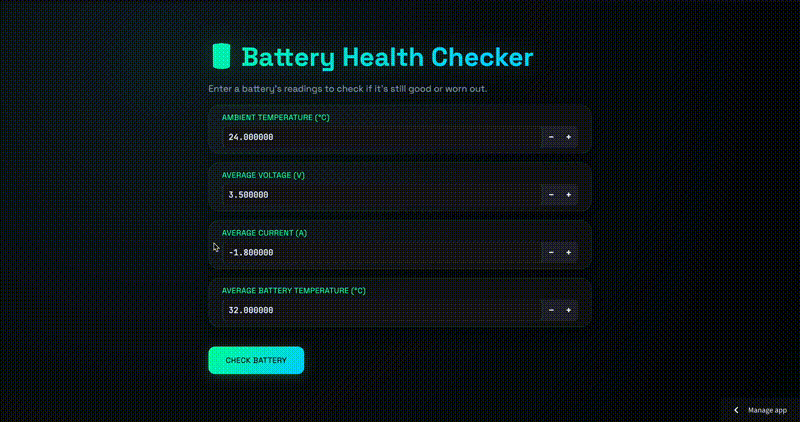
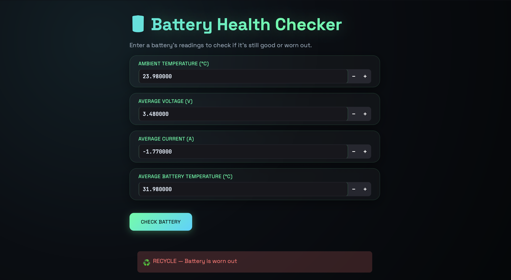

# 🔋 Battery Health AI

A machine learning classifier that predicts whether a used EV battery should be **reused** (second-life applications like stationary storage) or **recycled**, based on real NASA battery aging data.

## The Problem
Not every "dead" EV battery needs full recycling — many retain 70%+ capacity and can be repurposed. Manually testing every battery is slow and expensive. This project automates that first triage step.

## What It Does

- Trained a Random Forest classifier on 748 real battery cycle records (8 batteries) from NASA's Prognostics Center of Excellence dataset
- Predicts **good (reuse)** vs **worn_out (recycle)** from voltage, current, and temperature readings
- **96% recall on worn-out detection** — catches 25 out of 26 truly worn-out batteries in testing
- Interactive web app (Streamlit) for live predictions

## Why Capacity Isn't an Input
"Good" vs. "worn_out" labels were derived directly from capacity during training — so including capacity as a model input would let it just repeat the label back, not actually predict anything. The model deliberately uses only readings you *can* get instantly (voltage, current, temperature) instead of ones that require a full discharge test — that's the actual point: predicting the slow test's answer from fast, cheap sensor data.

## An Honest Trade-off I Found
Adding more training data (batteries tested under different discharge conditions) improved worn-out recall from 92% → 96%, but slightly reduced precision (100% → 93%) — meaning a few more healthy batteries get flagged for manual double-checking. For this use case, I judged that trade-off worth it: missing a genuinely worn-out battery is a costlier mistake than an extra manual check.

## Tech Stack
Python · pandas · scikit-learn · Streamlit · scipy (for parsing NASA's raw `.mat` files)

## Data Source
[NASA Prognostics Center of Excellence — Li-ion Battery Aging Dataset](https://www.nasa.gov/intelligent-systems-division/discovery-and-systems-health/pcoe/pcoe-data-set-repository/)

## Running It Locally
\`\`\`bash
pip install -r requirements.txt
streamlit run app.py
\`\`\`

## What's Next
- Expand to more battery chemistries/conditions
- Explore vision-based sorting to pair with a robotic arm for physical battery sorting
